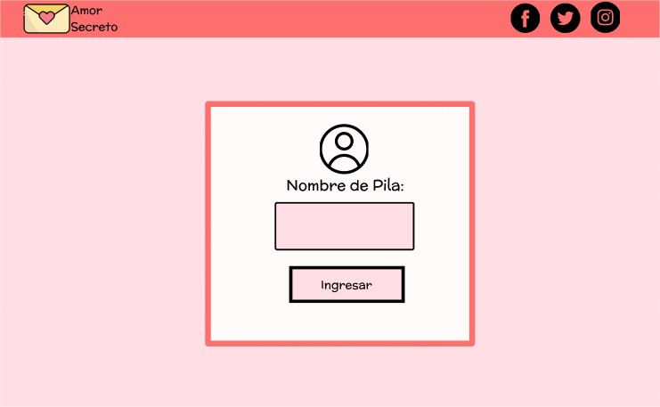

##  Amor secreto 
Como bien dice el titulo esta pagina web  esta basado para poder cifrar y decifrar frases y textos de amor.

## Prototipo

## Esta desarrollado para
Usuarios(as) enamorados(as) que no suelen decir lo que sienten directamente ,esta pagina web esta echo para ayudarte por fin a declararte a la persona que mas te gusta o decirle lo que sientes por escrito.

.El usuario o la usuaria que desea ocultar su frase o texto, podra cifrarlo y lo enviara con el codigo ASCII, asi quien lo reciba no podra entender lo que quieres decir.
.Para El usuario o la usuaria que lo reciba no sabra que dice y morira de la curiosidad de saber que le has escrito, para eso es nuestra web tambien para que decifres lo que te envien.

## Como utilizar la web para cifrar
Escribir texto que desea cifrar
Presionar el botón "Cifrar"
El mensaje cifrado aparecerá en el segundo cuadro de texto
Cortar o copiar el mensaje cifrado(codigo secreto)

## Como utilizar la web para decifrar
Pegar el texto en codigo secreto 
Presionar el boton "Decifrar"
El mensaje decifrado aparecerá en el segundo cuadro de texto.

## Color que deseo implementar 
El color rojo sin duda implementare usando tambien color rosado.

## Que implementare en la pagina web 
-Pantalla de inicio para que coloque su nombre de pila y le de la bienvenida con una alerta.
-Luego se trasladara a otra pantalla donde el usuario tiene que elegir si va "cifrar" o "decifrar" mediante un boton.
-Dependiendo que boton eliga le va dirigir a otra pantalla sea si selecciona "Cifrar" o "decifrar"
-En el caso si da click en el boto de "Cifrar" habra un cuadro donde pondra el texto da click en el boton "Cifrar" y al  cuadrado de al lado le saldra lo cifrado, tambien el usuario tendria la opcion de dar un click a un boton "Copiar texto" una vez ya lo haya cifrado.
-En "decifrar" habra un cuadro donde escriba o pegue el texto del Codigo secreto, luego daria click al boton "Decifrar" y en el cuadro de a lado se visualizara lo decifrado. 
-en la pantalla para que Cifre o Decifre , implemente un boton por si desea volver a la pantalla principal se llama "Pagina de inicio".